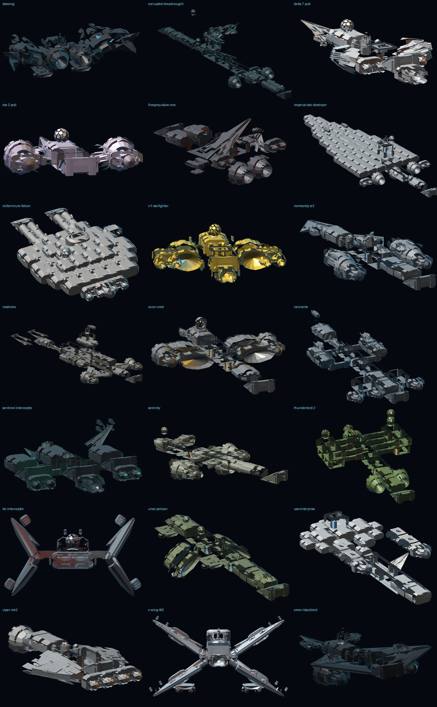
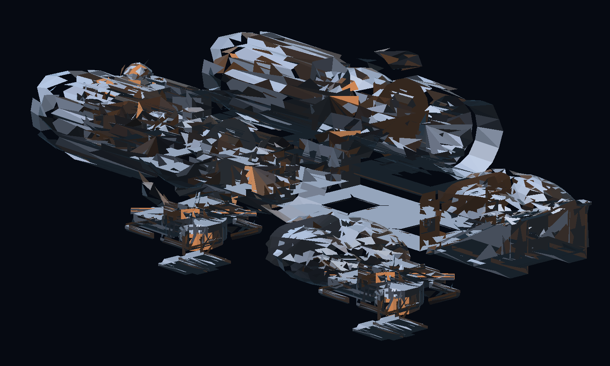
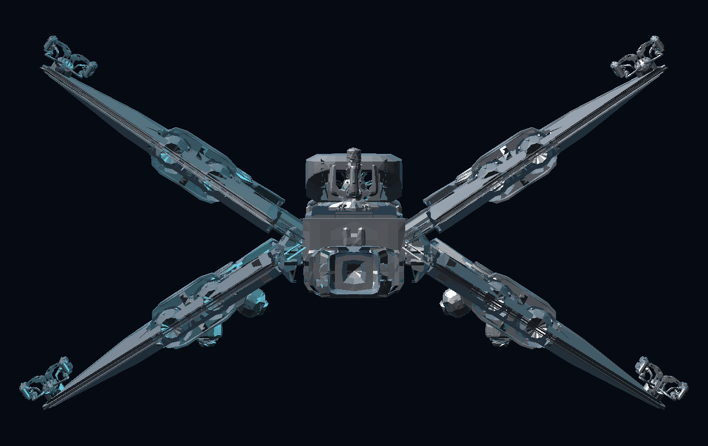

# NMS Corvette Shipyard

A companion web app for the **No Man's Sky "Corvette Workshop"** (Voyagers update, v6.0).
Browse every Corvette module, price a build before you spend a Unit, roll
role-weighted random hulls, and replicate iconic pop-culture ships with parts that
actually exist in the game.

Built with **Next.js (App Router) + React 19 + TypeScript + Tailwind CSS v4** and
**lucide-react** icons. Dark, neon, space-terminal aesthetic. No backend, no
database — everything runs client-side off two local JSON files.

### Real part meshes

The ship previews no longer use stand-in boxes. `public/models/corvette.bin`
holds **589 actual corvette part meshes** — `B_COK_A` cockpits, `B_STR_*_N` hull
blocks, `B_WNG_*` wings, `B_LND_*` landing gear, `B_TRU_*` boosters, `B_TUR_*`
turrets, `B_SHL_*` shields, `B_GEN_*` reactors and the whole decoration set —
converted from the corvette model library that ships with the open-source
*No Man's Sky Base Builder* add-on, at their true relative scale (one snap cell
is 6.0 × 3.0 × 6.0 source units). See them all at **`/models`**.

### Lattice prototype

`/lattice` assembles a real corvette from real parts on the game's own build
grid. A part's FBX origin **is** its snap point and its bounding box says how far
it reaches, so modules butt face-to-face with no fitted boxes:

```
next.z = current.z + current.zMin - next.zMax
```

`src/lib/lattice.ts` is the engine (`chainZ`, `flank`, `stack`), `src/lib/fleet.ts`
holds the recipes. The stage-1 probe is a fully kitted corvette: flight deck, two
habitation modules, a twin-cell connector and armoured tail, six wings, four
boosters, four legs and a dorsal battery — 25 modules, ~85k triangles at true
scale, with engine trails fired out of each booster's own aft face.

Mesh quality is set by `GRID` / `MAX_TRIS` in `build-part-models.py`. Clustering
coarsely is a trap: it snaps the surface to a lattice and turns hull plating into
spikes, so the grid is fine (400) and only the handful of giant parts hit the
triangle budget. 8.2 MB packed for 1.18M source triangles.

### Iconic ships, hand-drawn

The generic compiler in `src/lib/blueprintLattice.ts` lays a blueprint's parts
LIST out on the grid: a spine, then wings, engines, gear and guns bolted to it.
That is right for a Star Destroyer — it IS a spine with things bolted to it — and
wrong for anything whose shape *is* the ship. An X-Wing is four foils canted into
a cross; no amount of tweaking a router produces that.

So `src/lib/iconics/` hand-draws all 21. `dsl.ts` is the vocabulary:

| helper | what it means |
| --- | --- |
| `put` / `pair` / `row` | absolute placement, mirrored pair, bank along one axis |
| `span` / `spanPair` | "bolt this panel from A to B" — aims the part's own +x at B and solves `stretchX` so it reaches |
| `pod` / `prong` | a chain of modules at a lateral offset / one running forward |
| `standing` / `hanging` | sits or hangs a part on the surface beneath it |
| `fin` | a vertical fin (rolled 90°, so `standing` cannot measure it) |
| `extremeVertex` / `atTip` | where the part's metal actually ENDS, read from its vertices |

That last one is the difference between a cannon on a wingtip and a cannon
hanging in space next to it: a bbox claims a corner the metal never reaches.

All 21, and the one decision each of them turns on:

| ship | the decision |
| --- | --- |
| X-Wing | four S-foils hinged from **one** station, canted 33°, span stretched 3× |
| TIE Interceptor | ball pod on two pylons, four blades thrown out and up/down |
| Delta-7 / Eta-2 | needle noses (a `span` along the hull, not across it) |
| N-1 | engines slung at the wingtips |
| Viper Mk II | nose intake, five-cell tube, three nozzles across the tail |
| Batwing | one huge swept wing pair with the tips folded up |
| Sentinel | braced outriggers carrying forward-curving scythes |
| Pelican | droop wings with the engines at the tips, plus the tail boom |
| Blackbird | nacelles **under** the wing roots, twin tails standing on them |
| Razor Crest | 24 m long and 28 m wide: boxy hull, twin barrel engines |
| Falcon | two stacked decks, the front of the disc cut open, two mandibles |
| Star Destroyer | 12 rows from a one-cell prow to seven across, 1.8× longer than wide |
| Enterprise | wide saucer, neck buried in its underside, nacelles up on pylons |
| Serenity | raised bridge with the sensor mule on it, outboard VTL pods |
| Rocinante | seven-cell hull, four Epstein drives, sponsons, eight PDCs |
| Nostromo | towing arms forward, three-tier refinery tower amidships |
| Thunderbird 2 | the two pod carriers on braced struts |
| Firespray | flat hull flown upright, two-segment grapple arms |
| Normandy | CIC hump, swept wings, twin tails, two engine pods |
| Corrupted Dreadnought | four blades out of the flanks, stacked dorsal ridge |

Three failures worth recording, because they are what the numbers above are
avoiding: scaled cells still on a full-unit pitch read as **loose crates**; a hull
laid out wider than it is long reads as a **brick** (that was the Star Destroyer
at ten cells across); and stretched wing panels read as **fins** or **holes**,
because the game's wings are thin perforated plates.

Hand-drawn ships are painted from their own reference art rather than from the
catalogue's hull families, and each carries the camera it wants to be seen from
(a TIE opens on the bow, where its X reads).

A contact audit across all 21 — every module's box must overlap a neighbour's by
at least a 0.10 tolerance — reports **zero orphaned modules**. Renders of all 21
are in `docs/img/iconics/`, and the same set is browsable in the app: `/lattice`
is the index, `/lattice/<slug>` one ship with its snap-point table, and
`/assembly/<slug>` the step-by-step walkthrough built from the same recipe.







Rebuild the pack at any time:

```bash
python3 scripts/unreal/fbx.py                  # the FBX reader
python3 scripts/unreal/build-part-models.py \
  ../nms-base-builder/src/addons/no_mans_sky_base_builder/models/corvette
```

---

## Quick start

```bash
# 1. install dependencies
npm install

# 2. start the dev server
npm run dev            # http://localhost:3000

# 3. production build + run
npm run build
npm start
```

There is also a **fully offline local app** - no server, no internet, works from
a double-click:

```bash
npm run build:static   # builds a plain static bundle into out/
npm run start:local    # serves it on 127.0.0.1 and opens your browser
```

Or just double-click **`iniciar.bat`** (Windows) / run **`./iniciar.sh`**
(macOS, Linux): the launcher installs dependencies on first run, builds if
needed, and opens the shipyard.

Extra scripts:

```bash
npm run lint           # eslint (flat config, next/core-web-vitals + next/typescript)
npm run typecheck      # tsc --noEmit
npm run verify         # headless sanity check: data, generator logic AND the 3D renderer
npm run render:preview # rasterise fixed test views (scripts/out/*.png)
npm run render:gallery # rasterise ALL blueprints in their own hull styles
```

> `npm run verify` proves the important stuff without a browser: every iconic
> blueprint compiles into a **legal** Corvette (all Workshop minimums met, under
> the 160-module cap), seeds are deterministic, salvage-first mode really cuts the
> vendor bill, combat hulls out-gun minimalist ones, every blueprint renders inside
> the viewport at a frame rate that stays smooth to orbit, and **no module floats**:
> every part is socketed to a parent and the verifier asserts the join gap is
> 0.000 units across all 20 blueprints and all 6 hull families.

---

## Checks

Everything below runs offline against the committed mesh pack, and the last four
need nothing but Node:

```bash
npm run typecheck                          # tsc --noEmit
npm run lint                               # eslint
npm run verify                             # data invariants (costs, categories, ids)
npm run smoke   --prefix . 2>/dev/null || npx tsx --tsconfig tsconfig.json scripts/tools/smoke.ts
npx tsx --tsconfig tsconfig.json scripts/tools/audit.ts     # nothing floats, 21 ships
npx tsx --tsconfig tsconfig.json scripts/tools/all.ts       # re-render every ship
python3 scripts/tools/render-all.py                         # ...and its PNGs + sheet
```

`smoke.ts` is the one that answers "is it all working": it compiles all 21
blueprints, assembles them from the real pack, projects them the way the browser
viewer does, and asserts each ship has geometry, a sane envelope, a triangle
budget the DOM can carry, an asset behind every part, and engine trails.

## What's inside

### 1. Home dashboard (`/`)
Mode selector, Corvette Workshop briefing (where the terminal is, how salvage
works, part limits) and the live flight-certification checklist. Also shows the
build you currently have in progress.

### 2. Ship previews — what your build will actually look like
Every build view shows a **lit 3D render** of the finished Corvette, not just a
diagram:

* **Drag to orbit** the ship, scroll or use the zoom buttons, hit one of the five
  camera presets (Hero / Starboard / Plan / Bow / Stern), or let the **turntable**
  spin it.
* Hover any module to see **which part you are looking at**.
* Pick one of seven **hull families** — **Standard Corvette**, **Sentinel
  Interceptor**, **Solar Sail**, **Exotic Royal**, **Pirate Raider**, **Living
  Ship** and **Stealth Prototype** — to change plating, trim, engine glow, trail
  colour and background in one click. Tap a second family to **fuse** them into a
  hybrid hull.
* Flip the toggle to the **blueprint projection** at any time for the technical
  top-down diagram.

**Engine exhaust is rendered as a layered trail** (halo, glow, hot core, fading
with distance), and a shield envelope is drawn tight around the hull whenever the
build carries a shield generator. Space-family hulls get a starfield and nebula;
hangar-family hulls sit on a lit deck with a contact shadow.

The renderer is a compact software 3D pipeline written in `src/lib/render3d.ts` —
no WebGL, no 3D library, no external assets:

1. each module is turned into solid geometry from its `geometry` profile in the
   parts database (`arrowhead` bridge, `offset-dome`, `s-blunt-block`, `s-foil`,
   `hollow cone` engine bells, landing struts, turrets, …)
2. modules are placed on a hull footprint — habitation pods spiral outward on a
   square tile grid with alternating orientation, so hab-heavy builds grow into a
   saucer/slab hull instead of a corridor, with a spanning deck plate tying the
   cluster into one ship
3. **every module carries sockets** (fore / aft / side / top / bottom / hardpoint /
   mount). A part claims a free socket on the part it is being bolted to, and the
   attachment transform rotates its local frame onto the socket normal, so wings
   grow out of the flank, weapons sit on the wing hardpoints they are given, and
   engines line up on the stern grid. The renderer records the resulting
   parent-socket pair and its **gap** for every module, which is what `npm run
   verify` asserts is ~0
4. hull **style flourishes** (Sentinel engine rings, blade wings, solar sails,
   canted tail fins, pirate spikes, organic veins, flank rim glow) are generated
   from the same hull bounds and rooted inside the plating, so they can never
   float free either.
5. faces are shaded with ambient + diffuse (with a fill light so near-black
   Sentinel plating still reads) + rim + specular lighting, then sorted
   back-to-front (painter's algorithm) and projected as SVG polygons

Every module in the picker and the Parts Codex also gets its own small render, so
you can see a part before you place it.

**Why not the official part images?** The in-game module renders on
`nomansskyresources.com/corvette-parts` live on a CDN and are Hello Games' art.
Rather than hot-link someone else's CDN (which would break, and isn't ours to
redistribute), the app draws its own geometry from the same parts database — so it
works offline, stays consistent, and every part is previewable.

### 3. Manual Builder (`/builder`)
A step-by-step form that follows the order the Workshop expects:
Cockpit → Reactor → Habitation → Access Bay → Wings → Weapons → Shields →
Main Engine → Light Thrusters → Landing Gear → **Review & Shopping List**.

Every module you place updates in real time:
* a procedural **top-down hull schematic** (built from your actual parts)
* a 5-axis **stat radar** (damage / shield / manoeuvrability / hyperdrive / cargo)
* the **part budget** meter (x/160) and flight-certification checks
* the **shopping list** — buyable-at-vendor vs salvage-only, with costs

### 4. Randomizer & Role Generator (`/randomizer`)
Toggle role filters — **Combat**, **Exploration**, **Massive/Freighter-lite**,
**Minimalist** — plus hull size, salvage-first sourcing and symmetry lock.

**Sentinel mode** is a one-click preset that forces a corrupted-plating hull: blade
foils instead of wings, ion batteries instead of photon cannons, hover pads instead
of legs, shield reactors, and the black/crimson/ring-engine look from the game. It
names the ship the way Sentinels label their own hardware ("Quadium Pattern S-5266").

**Hull fusion**: pick two of the six families and the generator blends them — the
emissive trim, hot trim and engine trail are mixed, the flourish sets are unioned,
and the module weighting follows both families at once (sentinel + exotic pulls
blades, foils and oversized boosters). Fusion is seeded, so a shared link reproduces
the identical hull.

Role logic is deliberate, not cosmetic:
* **Combat** hard-locks a Deadeye Cannon + High-Energy Shield, pushes 3-6 hardpoints and 2+ shield generators
* **Exploration** forces the Zenith-Class reactor (best warp range) and adds Hab/Walkway slots while capping weapons
* **Massive** forces multiple Habitation modules and Heavy Landing Gear, adds main engines/landing bays and pads toward the cap
* **Minimalist** clamps the hull (≤ 24 modules at any size preset), strips plating and favours light parts

Rolls are **seeded and deterministic**, and the options are written into the URL
(`/randomizer?roles=combat,exploration&size=heavy&seed=12345`), so a link
reproduces the exact same ship for anyone who opens it. Generated hulls get a
procedural name ("The Void Leviathan", "MSV Warhammer M-5427") plus a written
rationale for the part choices.

### 5. Iconic Ship Blueprints — the "Badass Hangar" (`/blueprints`)
Twenty pre-made blueprint sheets, each tagged with the hull family it is meant to be
rendered in:

* **Star Wars** — Millennium Falcon, T-65 X-Wing, Imperial Star Destroyer,
  Razor Crest, N-1 Starfighter, Delta-7 Aethersprite (Anakin), Eta-2 Actis
  (Obi-Wan), TIE Interceptor, Firespray Gunship
* **No Man's Sky** — Sentinel Interceptor and Corrupted Dreadnought, both built in
  Sentinel plating with ring engines
* **Sci-fi & superhero** — UNSC Pelican, The Rocinante, USS Enterprise, Serenity,
  Viper Mk II, SSV Normandy SR-2, USCSS Nostromo, Thunderbird 2, The Batwing and
  the X-Men Blackbird

Each sheet lists every module with quantities and notes, marks optional cosmetic
parts, prices the vendor-buyable against the salvage-only modules, adds the
C → S Nanite bill, projects the silhouette and stat radar, and gives build tips
for making the shape read in-game. Load any blueprint into the builder and remix it.

### 6. Parts Codex (`/parts`)
The whole database, searchable/filterable/sortable, with prices, sourcing, mass
and per-stat contributions. One click drops a module into your active build.

### 7. My Hangar (`/hangar`)
Builds saved to `localStorage` (up to 40). Load them back into the builder, export
their shopping lists, or pin one as the active build.

---

## Data

Everything is driven by two files — edit them and the whole app re-prices and
re-renders itself:

| File | Contents |
| --- | --- |
| `data/parts.json` | 50 Corvette modules across 10 categories, with prices, sourcing, rarity, mass, cargo slots and stat weights |
| `data/blueprints.json` | The 20 pop-culture recipes, each with a `style` (hull family) and part refs from `parts.json` |
| `src/lib/shipStyles.ts` | The seven hull families: plating, trim, trail, environment, flourish set and module preferences |

`data/parts.json` also carries game rules used throughout the UI: the 160-module
cap, the 100-module soft cap, the 3-floor height recommendation, the 11 reactor
tech module limit, the ~7,630,000 Unit starter set and the ~85,000 Nanite
C → S-class upgrade.

**Workshop minimums encoded in the app** (from the referenced guides):
1 Cockpit, 1 Reactor, 1 Habitation Module, 1 Landing Bay (Access Module),
1 Main Engine, 2 Light Thrusters, 2 Landing Gear and 1 Weapon System.
Older/pre-6.0 builds only needed 1 thruster and 1 landing gear, so the UI shows
both values where they differ.

> Prices for vendor-buyable modules are the in-game Workshop prices. Salvage-only
> modules (e.g. Arcadia Heavy Booster, Aeron Powershield, Heavy Landing Gear)
> are not purchasable, so they show an estimated market value instead — that is
> flagged in the UI and in the data file's `meta.priceDisclaimer`.

---

## Project structure

```
data/
  parts.json              # module database + game rules
  blueprints.json         # pop-culture ship recipes
scripts/
  verify-logic.ts         # headless data + generator + renderer tests (npm run verify)
  render-preview.ts       # writes fixed test views to scripts/out (npm run render:preview)
  style-gallery.ts        # renders every blueprint in its hull style (npm run render:gallery)
src/
  app/
    layout.tsx            # shell: fonts, navbar, footer, build context
    page.tsx              # home dashboard / mode selector
    builder/page.tsx      # manual step-by-step builder
    randomizer/page.tsx   # role-weighted generator
    blueprints/page.tsx   # blueprint grid
    blueprints/[slug]/    # blueprint sheet
    parts/page.tsx        # searchable parts codex
    hangar/page.tsx       # saved builds
  components/
    BuildProvider.tsx     # React Context + localStorage persistence
    HullSchematic.tsx     # procedural top-down SVG ship preview
    StatRadar.tsx         # 5-axis performance radar
    ShoppingList.tsx      # buy/salvage list with tracker + export/print
    ShipPreview3D.tsx     # interactive 3D ship render (orbit / zoom / paint)
    ShipViewPanel.tsx     # ship-vs-blueprint toggle wrapper
    PartThumb.tsx         # per-module render thumbnail
    RequirementTracker.tsx# flight certification + part budget
    PartPicker.tsx / PartRow.tsx
    BlueprintSheet.tsx    # full blueprint sheet UI
    Navbar.tsx / Footer.tsx / ui.tsx / Icon.tsx
  lib/
    build.ts              # build math: stats, costs, requirements, markdown export
    randomizer.ts         # role weighting, sizing, guarantees, sentinel mode + fusion
    shipStyles.ts         # the seven hull families, fusion blending, hull paints
    render3d.ts           # software 3D renderer: sockets, geometry, lighting, projection
    schematic.ts          # hull layout geometry (blueprint view)
    names.ts              # seeded RNG + procedural ship names
    data.ts / types.ts    # typed access to the JSON databases
```

## Desktop app (optional)

```bash
npm run app          # run it as a desktop window (Electron)
npm run app:build    # package a Windows .exe installer into release/
```

`app:build` needs to run on your own machine - it downloads the Electron runtime
and builds a Windows installer, which is not possible from the development
sandbox. Both commands need `npm install` to have run once.

## Using your own game data

The parts database is hand-authored so the app runs with nothing installed. If you
own No Man's Sky and want the *real* module definitions (and optionally the real
meshes) instead, see **[docs/game-data-import.md](docs/game-data-import.md)** for
the unpacking pipeline and how to feed it in. Extracted assets stay local and are
git-ignored.

## Notes

* Fonts (Orbitron / Rajdhani / JetBrains Mono) are self-hosted via Fontsource,
  so no network access is needed at build or run time.
* The dev server binds to `0.0.0.0` when started with `next dev -H 0.0.0.0`, and
  `next.config.ts` allows the sandbox/preview origins.
* Every module is socketed to the part it is bolted to; the verifier fails the
  build if any attachment gap exceeds 0.02 units, which is what keeps wings, guns
  and engines from floating next to the hull.
* This is an unofficial fan tool. No Man's Sky is a trademark of Hello Games Ltd;
  pop-culture ship names belong to their respective rights holders.
